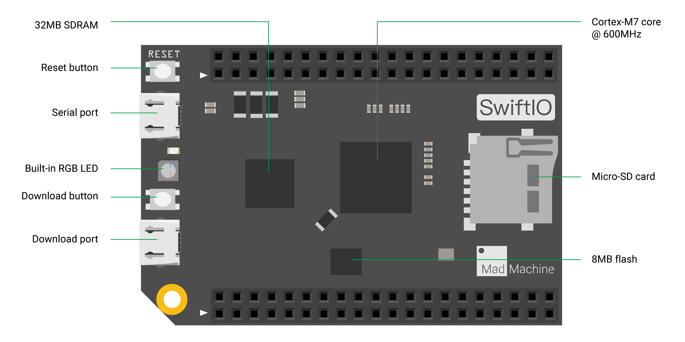
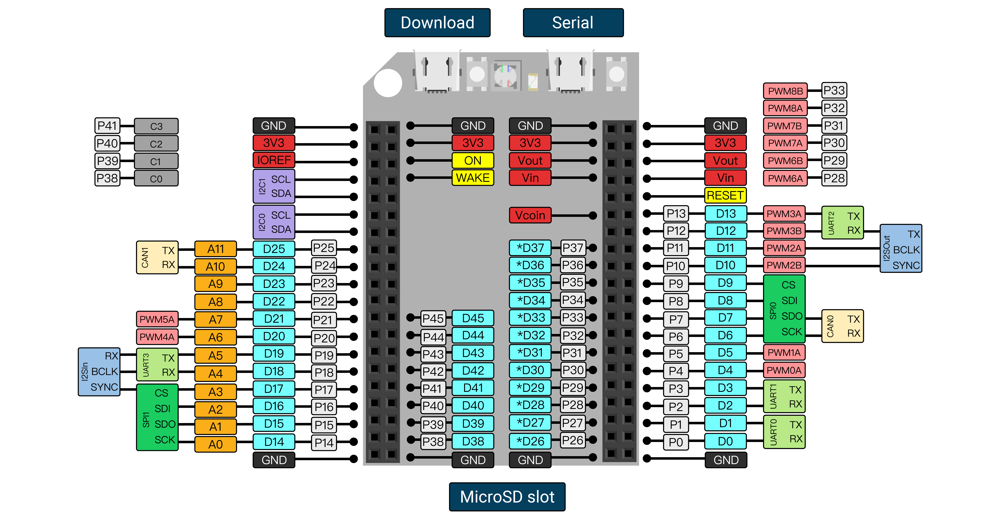

# SwiftIO Board

Let's look at parts of the SwiftIO board.

## **MCU**

i.MX RT1052 Crossover Processor with Arm® Cortex®-M7 core @600MHz. This 32-bit MCU has 600MHz clock and thus can run extremely quickly. It serves as the brain of the SwiftIO board to deal with all kinds of calculation.

## **Memory** 

The SwiftIO board has 8MB external flash, 32MB SDRAM.

## **Buttons**

You can see 2 buttons on SwiftIO board. 
- The **download button** allows to mount your board as a USB drive on your computer in order to download code. 
- The **reset button** can restart the code that has downloaded to your board. Sometimes, if your code don't run normally, you may press it to solve the problem.

## **Micro USB**

There are 2 USB ports, one for serial communication and one for code downloading. Both of them can be power your board.

- You need to connect the **Download port** on the SwiftIO board to your computer to download code.

- You can print the values and see them in serial monitor by connecting the **Serial port**, since there is a UART to USB converter on the board.

 

## **Built-in RGB LED** 
It contains red, blue and green LEDs. You can know from it the status of your board. Besides, you can control them by setting digital levels. 

| LED State | RED | GREEN | BLUE |
| :--- | :--- | :--- | :--- |
| On | USB communication failed | USB connection established | - |
| Slow flashing | Fail to verify file `swiftio.bin` | - | - |
| Fast flashing | Fail to open file `swiftio.bin` | Detecting USB connection | Detecting SD card |

:::note
When you apply a low voltage, the built-in LEDs will be on. When you apply a high voltage, they will be off.

:::

## **Pins**

**Power pins**: GND and 3.3V. There are 8 GND (ground) pins on your board to ground the circuit and 4 3V3 pins that supply 3.3V of power to your module.

**DigitalIn/Out**: The digital pins are labeled D0 to D45 on SwiftIO board. These pins can act as digital input pins to read logic value or as output pins to control other circuits.

**AnalogIn**: SwiftIO board has 12 analog pins from A0 to A11. You can use them to measure analog inputs and get a raw value between 0 and 4095 (12-bit resolution).

**PWMOut**: The digital pins marked with a tilde can generate PWM wave, 14 pins in total. You can set the duty cycle to simulate different output voltages. Some of the pins are paired and share the same frequency, like PWM3A and PWM3B. 

**I2C**: I2C0 and I2C1. Each onw contains two wires: SCL for clock signal, SDA for data transmission. You can use I2C protocol to communicate with different devices by writing and reading messages through the bus..

**SPI**: SPI0 and SPI1. It needs 4 wires: CS for device selection, SDI to receive data, SDO to send out data, SCK for clock signal. The communication speed of SPI is faster than I2C and UART.

**UART**: UART0 to UART3. Two wires are required for UART communication: TX pin is for transmission and RX is for reception. The board can communicate with other external devices through these pins or with computer through USB cable.

**CAN**: CAN0 and CAN1. It uses 2 wires to receive and send data using CAN protocol.

**I2SIn**: it allows you to receive audio signal from other devices. You can see it needs 3 wires: RX is to receive data, BCLK carries clock signal, SYNC for left or right channel selection.

**I2SOut**: it allows you to send audio siganl to other devices. It needs 3 wires: TX is to send data, BCLK carries clock signal, SYNC for left or right channel selection.

**RESET**: restart the code when the RESET pin is set to low.

**Vin**: you can supply voltage to the board using external power source through Vin pin. You'd better apply voltages between 5V to 12V.

**Vout**: the Vout pin will provide the higher output voltage between Vcc and  USB voltage.

**Vcoin**: button cell can power the RTC through the Vcoin pin when there is no power supply.

