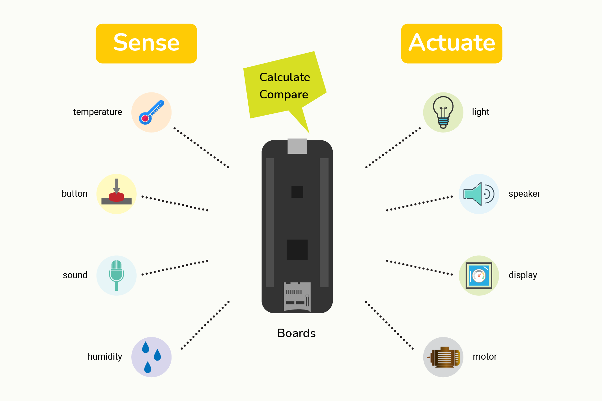

# Introduction

Welcome to the MadMachine! Excited to see you here!!!

Maybe you are not clear about the way all stuff works. Don't worry, let's find it out together.

## What is MadMachine?

Our project all focuses on Swift language and microcontrollers. We provide you with the necessary hardware and software support to explore together the possibility of their combination. You can program your board in Swift language to control all kinds of hardware, like LEDs, speakers, motors, or make them responsive to your actions. 

Well, here's a little bit of background. You can skip this part if you're familiar with it.

### Swift language

Let's first talk about [Swift language](https://docs.swift.org/swift-book/). It is a programming language created by Apple. Nowadays, it's widely used for application development. Besides, many developers from all over the world are finding its possibilities in different filed, like server-side, etc. 

With many years of experience in electronics engineering, we strongly believe huge potentials of Swift in the microcontroller world. It is a powerful, efficient, easy-to-learn language, and can the hardware programming can be more friendly and secure.

### Microcontroller

When it comes to microcontrollers, many guys may have different definitions. In brief, you can take them as small computers. You program it to receive or send data. We'll dive deeper into hardware in section [Learn](../learn/overview.md).

It is everywhere in our daily life and usually embedded in all kinds of devices. You can see them in keyboards, printers, microwave ovens, washing machines... But the microcontrollers in them are programmed in advance to perform specific tasks and have limited functionalities. 

There are also some microcontrollers with more usages and can be programmed by you to do multiple tasks, with endless possibilities, like our boards, [Arduino](https://www.arduino.cc/)...

### And then...

Yeah, they can now work together!!! You can write several lines of Swift code to get some stuff to work. 

You guys don't need to know complicated low-level stuff, simply starting with some example projects, no matter you have or don't have related knowledge.  

## What can I do with all boards?

There're endless possibilities... You can get inspiration from [instructables](https://www.instructables.com/circuits/projects/) and [hackster](https://www.hackster.io/projects?ref=topnav).

The principles of all kinds of projects are not that complicated. To sum up, your board gets info from your surroundings, like light, temperature, sound, or your action like pressing a button, touching a screen. After it gets data, it will show it in ways like lighting, display, movement, sound, etc. Of course, what your board will do is all decided by your code.

:::note
After all, microcontrollers are not computers, so you cannot expect them to do everything, especially some tasks that need heavy computing power.
:::

## What do I need?

At first, you certainly need a board to work with. Our board family has two boards now: [SwiftIO board](hardware/swiftio-board.md) and [SwiftIO Feather board](hardware/swiftio-feather.md). They both come with beginner kits to help you start. 

To program your board, you need to install the [MadMachine IDE](https://github.com/madmachineio/MadMachineIDE/releases/tag/v0.2.3-alpha). It allows you to edit, compile and download code. 

Let's keep going.

## Resources

Never be afraid that you have no prior experience. You can follow the tutorials to get started. There are 5 sections in all, and you can navigate them by clicking on the header.

- [**Overview**](#introduction) - start from here to get familiar with the MadMachine project and basic operations.

- [**How-to**](../how-to/create-new-project.md) - learn some useful guides for your projects.

- [**Learn**](../learn/overview.md) - then learn A to Z of electronics to understand better how everything works.

- [**Tutorials**](../tutorials/overview.md) - try some built-in projects and get inspirations. 

- [**Reference**](../reference/reference.md) - consult the documentation of APIs as you program your board.

## More info

- [Twitter](https://twitter.com/madmachineio) – know who we are.

- [Discord](http://madmachine.io/discord) – discuss and share your opinions.
 
- [Github](https://github.com/madmachineio) – find SwiftIO source code.
 
- [Youtube](https://www.youtube.com/c/MadMachineio) – learn with us step-by-step.

Our boards are stable enough to be used in most of your projects. We believe you will love it once you start. Besides, it's super easy to learn. And as you go further, you will see its charm.

Hope all of you will enjoy it.