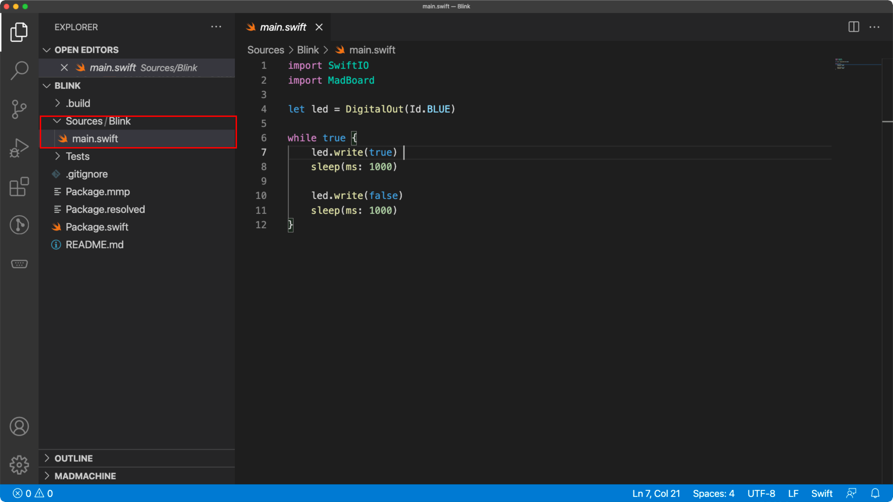
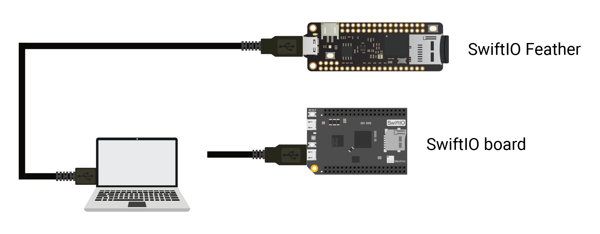
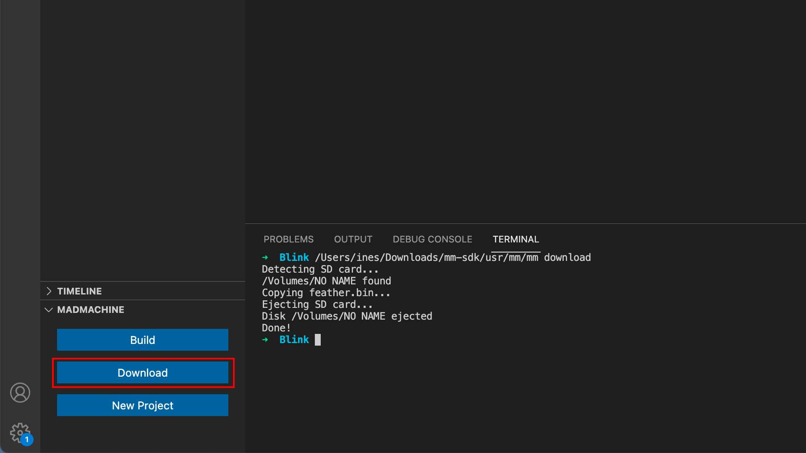

# Run your first project

Now that you‘ve got your board, let's start with a hello world project - LED blink. 

## Step 1: Download and install the MadMachine IDE

At first, you certainly need a tool to edit your code. MadMachine IDE allows you to write code, compile and download it to your board. 

You can get the latest IDE for macOS [here](https://www.madmachine.io/downloads). And your computer should have Xcode to allow the code to compile successfully. 


The IDE for Windows doesn't support our new features since we are waiting for the Window support of Swift language. 

Double click the downloaded file and follow the installation instructions. If you have any problem, you can refer to [FAQ](./faq.md). 

:::info
For advanced users, you may edit your code wherever you like and use the [mm-sdk](https://github.com/madmachineio/mm-sdk) to compile your code.
:::


## Step 2: Code in the IDE

Now, you're ready to code. 

1. **Open** the MadMachine IDE. Now it's empty on the right side, as you create and try more projects, it will be filled with all your projects.


2. Click **Create a new MadMachine project**.


3. **Name** the project. We call it `Blink`. You can choose any descriptive name you like for the project. Choose the **board** you are going to use. Leave the rest as they are. Then click **Create**.


4. The new project is created. The left panel may be empty when the window opens as it needs time to load the files.


5. Now it's time to write the code. Click on the left panel `Sources` / `Blink` / `main.swift` to open the file. You will always edit the code in the file `main.swift` in your future projects. Copy and paste the following sample code into the file.

```swift
import SwiftIO
import SwiftIOFeather

let green = DigitalOut(Id.GREEN)
​
while true {
    green.write(true)
    sleep(ms: 1000)
    green.write(false)
    sleep(ms: 1000)
}
```


:::info
There are also built-in example codes in the IDE. You can view them by clicking the button  on the bottom left corner. Double click on the projects `Blink` in the folder `GettingStarted`. The code will show up in a new window. 

Please make sure the board you are using is the same as the example. You can follow the instructions [here](../how-to/select-board.md) to change the board used in code.
:::

## Step 3: Prepare SD card and confirm USB connection

You may notice the message on the status bar saying the board is not connected yet. And the download button on the upper left corner is not clickable. 


So connect the board to your computer first.

1. Make sure that you have inserted an **SD card** into the slot.


2. Connect the board to your computer through the **Download port** using a USB cable. SwiftIO Feather board has only the download port. SwiftIO board has both download and serial port, so make sure you connect the right port.



3. Press the **Download button**. Once pressed, your board will appear as a USB Drive on your computer. There are two buttons on your board. The one labeled "**Download**" or "**DL**" is the correct one. The positions of the button on the two boards are as below.  


:::note
Bad quality USB cable or some third-party USB hub may cause connection failure. If the board still fails to connect to your computer, you can refer to [FAQ](./faq.md##USB-driver-can't-be-mounted).
:::


4. The onboard RGB LEDs will show the current status of the USB connection. Wait for several seconds until the LED turns to **steady green**.

| LED State | RED | GREEN | BLUE |
| :--- | :--- | :--- | :--- |
| On | USB communication failed | USB connection established | - |
| Slow flashing | Fail to verify bin file | - | - |
| Fast flashing | Fail to open bin file | Detecting USB connection | Detecting SD card |


## Step 4: Build and download the code to your board

1. Once the SD card is mounted successfully, the message on the status bar will change to **"XXX ready"**. XXX corresponds to the board you're using.

2. Click the Download  button.


The IDE begins to build your project and download it to your board if there is no error. 

After the code is downloaded, the USB drive will be removed automatically.


Congratulations! The onboard green LED begins to blink per second.