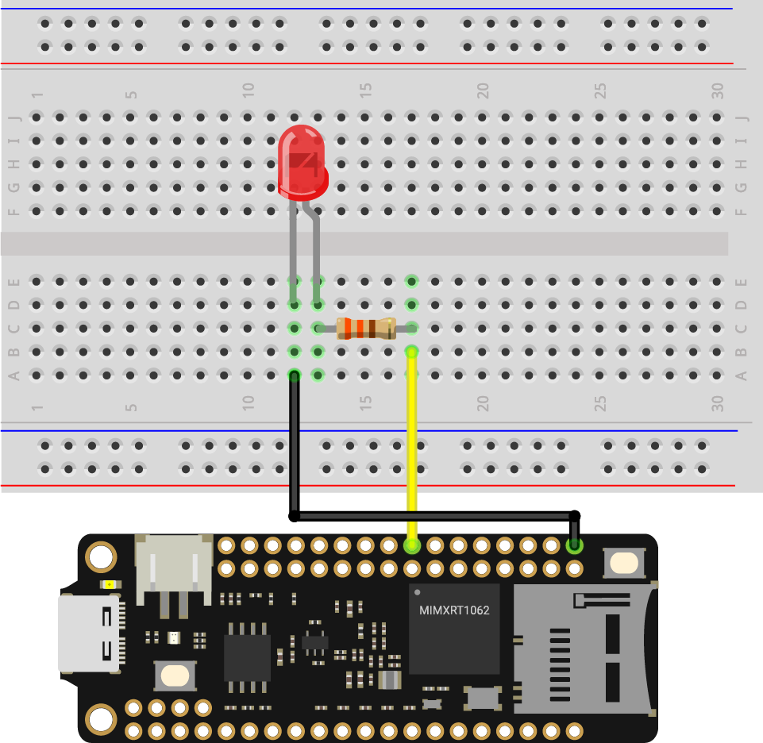
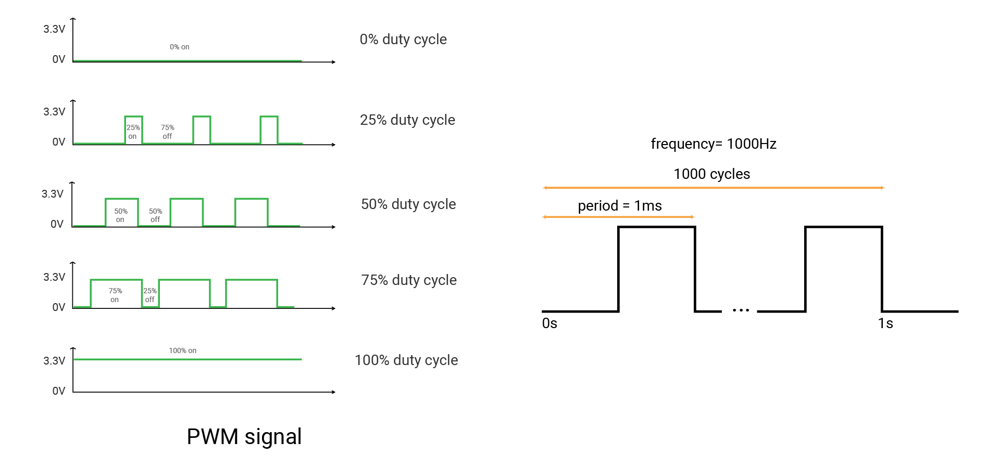

# PWM Brightness Control

You may notice the breathing light on your phone when a new message comes. It smoothly changes from dark to bright and back to dark. In this project, let's try to realize it using an LED. 

## What you need

- SwiftIO Feather (or SwiftIO board)
- Breadboard
- LED
- 330ohm resistor
- Jumper wires

## Circuit

Let's build the circuit as below.

1. Place the LED onto the breadboard.
2. The long leg (anode) of LED goes to PWM4B through a resistor.
3. The short leg (cathode) of LED connects to the ground.




## Example code

You can find the example code at the bottom left corner of IDE:  / `GettingStarted` / `PWMBrightnessControl`.

```swift
// Brighten or dimming the LED by changing the duty cycle of a PWM signal.
// Import the library to enable the relevant classes and functions.
import SwiftIO

// Import the board library to use the Id of the specific board.
import SwiftIOFeather

// Initialize the PWM pin the LED connects, with other parameters set to default.
let led = PWMOut(Id.PWM4A)

// Initialize a variable to store the value of duty cycle.
var value: Float = 0.0

// Change the brightness from on to off and off to on over and over again.
while true {
    // Brighten the LED in two seconds.
    while value <= 1.0 {
        led.setDutycycle(value)
        sleep(ms: 20)
        value += 0.01
    }
    // Keep the duty cycle between 0.0 and 1.0.
    value = 1.0

    // Dimming the LED in two seconds.
    while value >= 0 {
        led.setDutycycle(value)
        sleep(ms: 20)
        value -= 0.01
    }
    // Keep the duty cycle between 0.0 and 1.0.
    value = 0.0
}
```


## Background

### Pulse Width Modulation (PWM)

Pulse Width Modulation (PWM) can simulate analog results digitally. The signal is still a square wave that switches between on and off. The duration of the "on-time" is called the **pulse width**. So this technique will change the duration of high level relative to low level. In this way, it will simulate the voltage between fully open (3.3 volts) and off (0 volts).  

In this case, if you repeat this switching pattern with LEDs fast enough, the signal seems to be a stable voltage between 0 and 3.3v. And the LED would show different brightness.

Now come more concepts. A fixed time **period** consists of on and off time. The duration or period is the inverse of the PWM **frequency**. For example, when the PWM frequency is 500 Hz, one period is 2 milliseconds.

The **duty cycle** is the percentage of on-time of output signal during one period. Its range is 0-1. 1 means the output is always on. 0 means the voltage is always low. And the signal with a 0.5 duty cycle is on for 50% of the time and off for 50% of the time.



## Code analysis

```swift
let led = PWMOut(Id.PWM4A)
```
Initialize the PWM pin the LED connects. You may notice the pin names of PWM are a little strange, with "A" or "B" after the number. Since there are 14 pins for PWM in total, some pins are paired, like PWM3A and PWM3B. Two paired pins can only share the same frequency.

```swift
var value: Float = 0.0
```
The duty cycle would change all the time to change the brightness of the LED. So you need a variable to store its value. `var` is the keyword to declare a variable. Just like its name, its value can always change after it has been assigned. 

The `value` is explicitly declared as a floating-point number type. This is very important when the type is easy to be confused. For example, 0.0 could be float or double. And each numeric type has a different range of numbers. 

```swift
while value <= 1.0 {
    led.setDutycycle(value)
    sleep(ms: 20)
    value += 0.01
}
```

It ensures the value not bigger than 1.0 and gradually brightens the LED. `.setDutyCycle` method allows you to set the duty cycle. Each time, you will gradually increase the value by 0.01. The brightening process lasts for 2 minutes. To ensure a smooth brightness change, you need to set appropriate value change and sleep time. 

```swift
value = 1.0
```
After finishing the first loop, the value is about 1.01. So `value = 1.0` is to keep it in the specified range.  The second while is similar but to dim the LED. 

## Reference

[PWMOut](https://swiftioapi.madmachine.io/Classes/PWMOut.html) - set the PWM signal.

- `init(_:frequency:dutycycle:)` - initialize a PWM pin. You need to tell the id of a specified pin to initialize it. The frequency and duty cycle have their default value. You can set their values or change them later.

- `setDutycycle(_:)` - set the on-time of the signal to change the average voltage.

[SwiftIOFeather](https://github.com/madmachineio/MadBoards/blob/main/Sources/SwiftIOFeather/Id.swift) - find the corresponding pin id of SwiftIO Feather board.