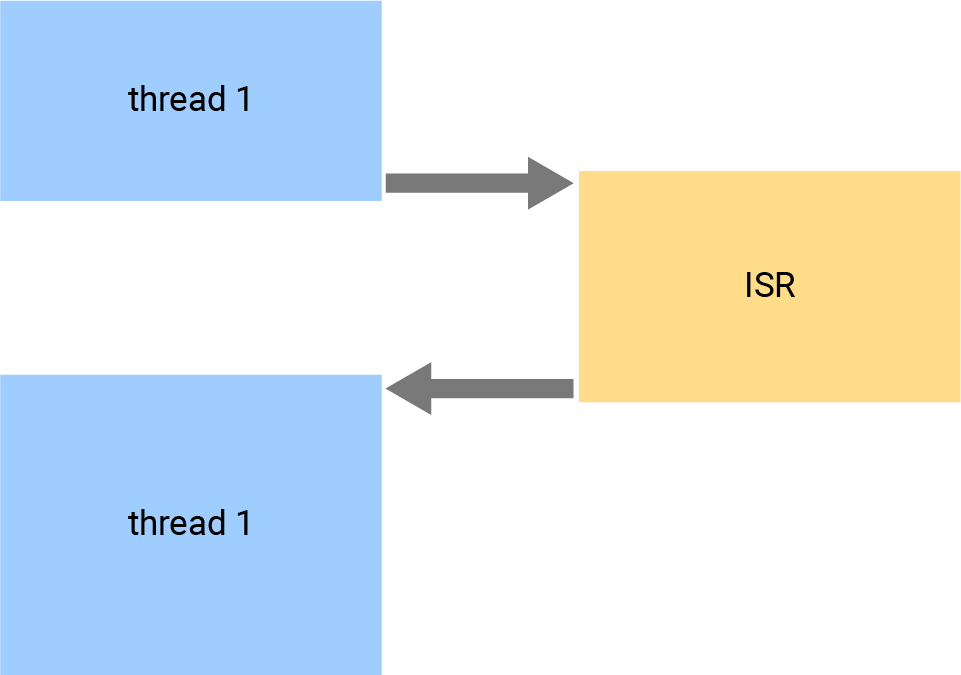

# Blink timer

In the previous demo, you change the output constantly and using the function `sleep` to blink LEDs. Besides, you can use a timer to realize the same effect. So this example shows how to use the timer and interrupt mechanism on your board to make the red LED blink per second.

## What you need

- SwiftIO Feather (or SwiftIO board) 


## Circuit

All you need is a compatible board. Connect it to your computer to download the code.


## Example code
You can find the example code at the bottom left corner of IDE:  / `SimpleIO` / `BlinkTimer`.

```swift
// Change the LED state every second by setting the interrupt.
// Import the library to enable the relevant classes and functions.
import SwiftIO

// Import the board library to use the Id of the specific board.
import SwiftIOFeather

// Initialize the red onboard LED and a timer to set interrupt.
let red = DigitalOut(Id.RED)
let timer = Timer()

// Raise the interrupt to turn on or off the LED every second.
timer.setInterrupt(ms: 1000) {
    red.toggle()
}


while true {

}
```

## Background

### Interrupt

An interrupt ensures that the processor responds immediately to some events. When a given condition meets, the processor will stop its current job to perform other tasks with higher priority, called ISR. In this way, your board can do something else without waiting there doing nothing.

The interrupt can happen under several different conditions. You will use a timer to trigger it in this demo.



:::note
The function you choose for interrupt should be able to execute **extremely quickly**. Usually, we tend to change the state of pins or some values. 
:::

###  Timer

The timer is a part of the hardware on the board. It works just like an alarm clock. You set the time interval for the interrupt. If the time is up, the microcontroller will execute the specified program. 

## Code analysis

```swift
let timer = Timer()
```
Initialize a timer. It requires no parameters.

```swift
timer.setInterrupt(ms: 1000) {
    red.toggle()
}
```

The method `setInterrupt()` is used to set the interval and the ISR. It has 4 paramter in all:

`setInterrupt(ms period: Int, mode: Mode = .period, start: Bool = true, _ callback: @escaping ()->Void)`

1. ms: it is the specific period in milliseconds.
2. mode: it decides whether the ISR will be done once or repeatedly.
3. start: it decides if the timer works as soon as you set it. If not, you can start it manually later.
4. callback: it is the task your board will do. It is a void function and is the last parameter, so you can move this into a pair of curly brackets as `red.toggle()` above.

The method `.toggle()` can change the digital signal from one level to the other. 

In this way, the red LED light will be switch on or off every second.

In the loop, you can make the board do something else when the interrupt has not worked.

## Reference

[DigitalOut](https://swiftioapi.madmachine.io/Classes/DigitalOut.html) - set whether the pin output a high or low voltage.

[Timer](https://swiftioapi.madmachine.io/Classes/Timer.html) - set the timer to make your board do some certain tasks at a fixed time.

[SwiftIOFeather](https://github.com/madmachineio/MadBoards/blob/main/Sources/SwiftIOFeather/Id.swift) - find the corresponding pin id of SwiftIO Feather board.
