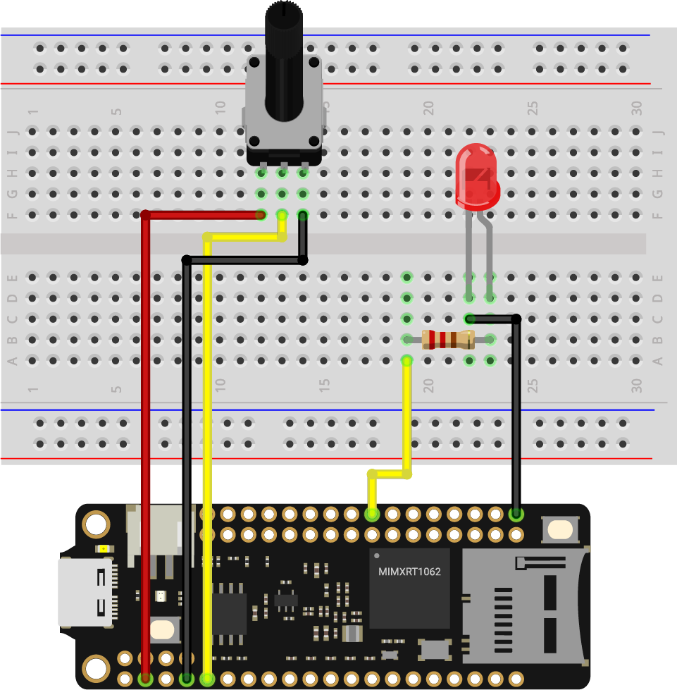

# Brightness AnalogIn

In this example, we use PWM to adjust the brightness of an LED according to the position of the potentiometer.

## What you need

- SwiftIO Feather (or SwiftIO board)
- Breadboard
- Potentiometer
- LED
- 330ohm resistor
- Jumper wires


## Circuit

1. Place the potentiometer onto the breadboard. Connect the legs on the left to pin **3V3**, connect the second leg to pin **A0**, and the third leg to pin **GND**.
2. Place the LED onto the breadboard. The long leg of LED goes to **D19** through a resistor. The short leg connects to **GND**.



## Example code

```swift
// Read the analog input value and use it to set the PWM output to change the LED brightness.
// Import the library to enable the relevant classes and functions.
import SwiftIO

// Import the board library to use the Id of the specific board.
import SwiftIOFeather

// Initialize an analog input and a digital output pin the components are connected to.
let sensor = AnalogIn(Id.A0)
let led = PWMOut(Id.PWM0A)

// Allow the LED brightness control all the time.
while true {
    // Read the input voltage in percentage.
    let value = sensor.readPercent()
    // Light the LED by setting the duty cycle.
    led.setDutycycle(value)
    // Keep the current LED state for 200 millisecond.
    sleep(ms: 200)
}
```


## Code analysis

```swift
let value = sensor.readPercent()
```

There are three available methods to get analog values in different forms. In this case, you will need `.readPercentage`. It will return a percentage representing the ratio between actual voltage and reference voltage (3.3V). The value can then be used as duty cycle to set the LED brightness.

## Reference

[DigitalOut](https://swiftioapi.madmachine.io/Classes/DigitalOut.html) - set whether the pin output a high or low voltage.

[AnalogIn](https://swiftioapi.madmachine.io/Classes/AnalogIn.html) - read the voltage from an analog pin.

[SwiftIOFeather](https://github.com/madmachineio/MadBoards/blob/main/Sources/SwiftIOFeather/Id.swift) - find the corresponding pin id of SwiftIO Feather board.


