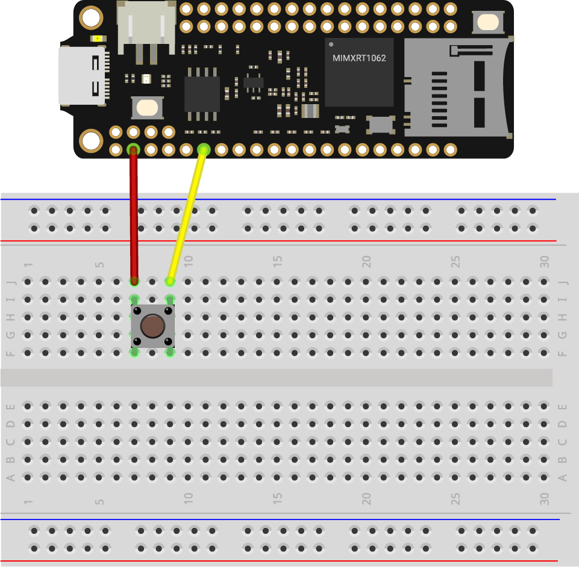

# Button control LED

In this example, you will use a pushbutton to control the LED. The input signal will change as you press the button. Thus, you can set LED states according to input states. When you press the button, the LED turns on. When you release it, the LED turns off.

## What you need

- SwiftIO Feather (or SwiftIO board)
- Breadboard
- Button
- Jumper wires


## Circuit

1. Plug the button into the breadboard. Make sure the button is not in the wrong direction.
2. Connect one leg on the left side to the pin 3V3. 
3. Connect one leg on the right side to pin D1. 




## Example code

Here comes the code. You can find the example code at the bottom left corner of IDE:  / `SimpleIO` / `ButtoncontrolLED`.

```swift
// Read the input signal controlled by a button to turn on and off the LED.
// Import the library to enable the relevant classes and functions.
import SwiftIO

// Import the board library to use the Id of the specific board.
import SwiftIOFeather

// Initialize the red onboard LED.
let red = DigitalOut(Id.RED)

// Initialize a digital input pin D1 the button is connected to.
let button = DigitalIn(Id.D1)

// Allow the button to control the LED all the time.
while true {
    // Check the state of button. If it is pressed, the value will be true and then turn off the LED.
    // Modify the code according to your button if necessary.
    if button.read() {
        red.write(false)
    } else {
        red.write(true)
    }

}
```


## Code analysis

```swift
if button.read() {
    red.write(false)
} else {
    red.write(true)
}
```

First, you'll need to check the button state. The method `.read()` reads the value from the digital input pin. The return value is a boolean value, either `true`(1) or `false`(0). 

Then use **if-statement** to decide the LED state according to the value. If the value is `true`, the button has been pressed, so turn on the LED. Otherwise, turn off the LED.

If you have experience with Arduino, you may notice there's no pull-down resistor on the button. That's because our boards already have built-in pull resistors. Reference the [`Mode`](https://swiftioapi.madmachine.io/Classes/DigitalIn/Mode.html) in `DigitalIn` class for more information.

## Reference


[DigitalOut](https://swiftioapi.madmachine.io/Classes/DigitalOut.html) - set whether the pin output a high or low voltage.

[DigitalIn](https://swiftioapi.madmachine.io/Classes/DigitalIn.html) - read the input value from a digital pin.

[SwiftIOFeather](https://github.com/madmachineio/MadBoards/blob/main/Sources/SwiftIOFeather/Id.swift) - find the corresponding pin id of SwiftIO Feather board.