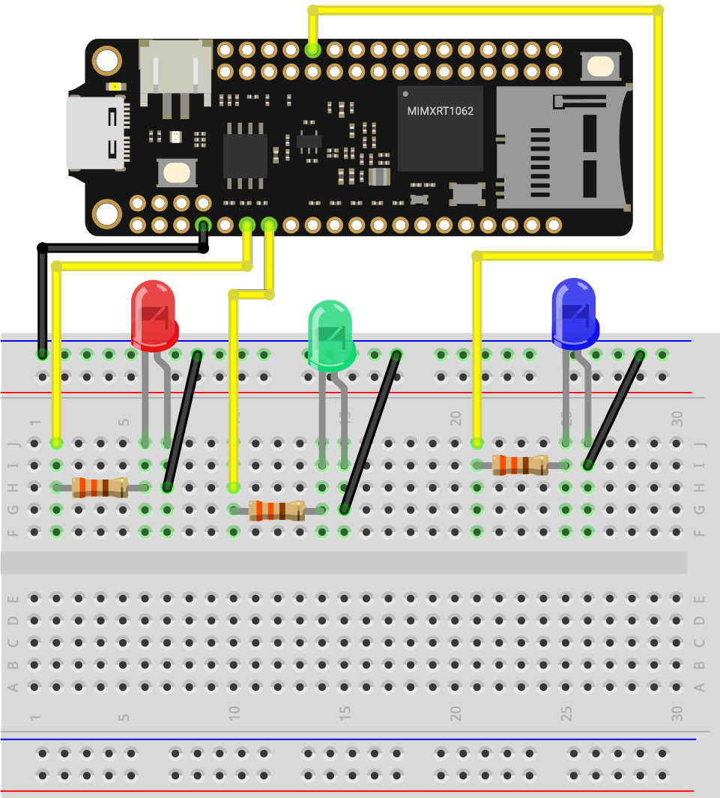

# LEDs brightness control

This demo is similar to the previous PWM brightness control, but you will make 3 LEDs to do so one by one. 

## What you need

- SwiftIO Feather (or SwiftIO board)
- Breadboard
- 3x LEDs
- 3x 330ohm resistors
- Jumper wires

## Circuit



## Example code

```swift
// Change the LED state every second by setting the interrupt.
// Import the library to enable the relevant classes and functions.
import SwiftIO

// Import the board library to use the Id of the specific board.
import SwiftIOFeather

// Initialize the pins the LEDs are connected to and put them in a array.
let red = PWMOut(Id.PWM0A)
let green = PWMOut(Id.PWM1A)
let blue = PWMOut(Id.PWM2B)
let leds = [red, green, blue]

// Declare a variable to store the value of duty cycle.
var value: Float = 0.0

// Change the brightness of each LED over and over again.
while true {
    // Iterate each LED in the array. 
    // This allows the LED to go through the following process one by one.
    for led in leds {
        // Brighten the LED in two seconds.
        while value <= 1.0 {
            led.setDutycycle(value)
            sleep(ms: 20)
            value += 0.01
        }
        // Keep the value of duty cycle between 0.0 and 1.0.
        value = 1.0
        // Dimming the LED in two seconds.
        while value >= 0 {
            print(value)
            led.setDutycycle(value)
            sleep(ms: 20)
            value -= 0.01
        }
        // Keep the value of duty cycle between 0.0 and 1.0.
        value = 0.0
    }
}
```

## Code analysis

```swift
let leds = [red, green, blue]
```
There are 3 LEDs in total. They all repeat the same operations. So you can put them in an array. 

An **array** is a collection of ordered values of the same type. To access its item, you can use its index. The index starts from 0. So if you want to access red led, it's `leds[0]`.

```swift
for led in leds {

}
```

Then you can use `for-in` loop to iterate over the array. That's why you create it. You can avoid repeating the same code many times and thus simplify the code.

`led` represents each item in the array `leds`, and you can name it as you like. In the loop, the first item will execute the code in the brackets. After that, the second one repeats the task. The task will repeat several times until all items finish it.

## Reference

[PWMOut](https://swiftioapi.madmachine.io/Classes/PWMOut.html) - set the PWM signal.


[SwiftIOFeather](https://github.com/madmachineio/MadBoards/blob/main/Sources/SwiftIOFeather/Id.swift) - find the corresponding pin id of SwiftIO Feather board.